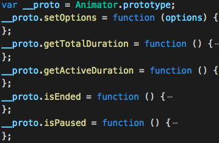

# prototype-minify-webpack-plugin [](https://www.npmjs.com/package/prototype-minify-webpack-plugin)

Minify prototype for typescript or unminfited prototype.
```
$ npm i prototype-minify-webpack-plugin
```

|Before|After|
|:---:|:---:|
|||

## How to use
```js
import PrototypeMinifyPlugin from 'prototype-minify-webpack-plugin';

{
  plugins: [
    new PrototypeMinifyPlugin(),
  ]
}

```