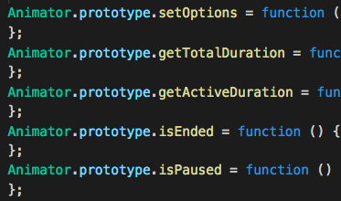

# rollup-plugin-prototype-minify [](https://www.npmjs.com/package/rollup-plugin-prototype-minify)

Minify prototype for typescript or unminfited prototype.

|Before|After|
|:---:|:---:|
|||
```js
import PrototypeMinify from 'rollup-plugin-prototype-minify';

export default {
  plugins: [
    PrototypeMinify({sourcemap: true}),
  ],
}
```